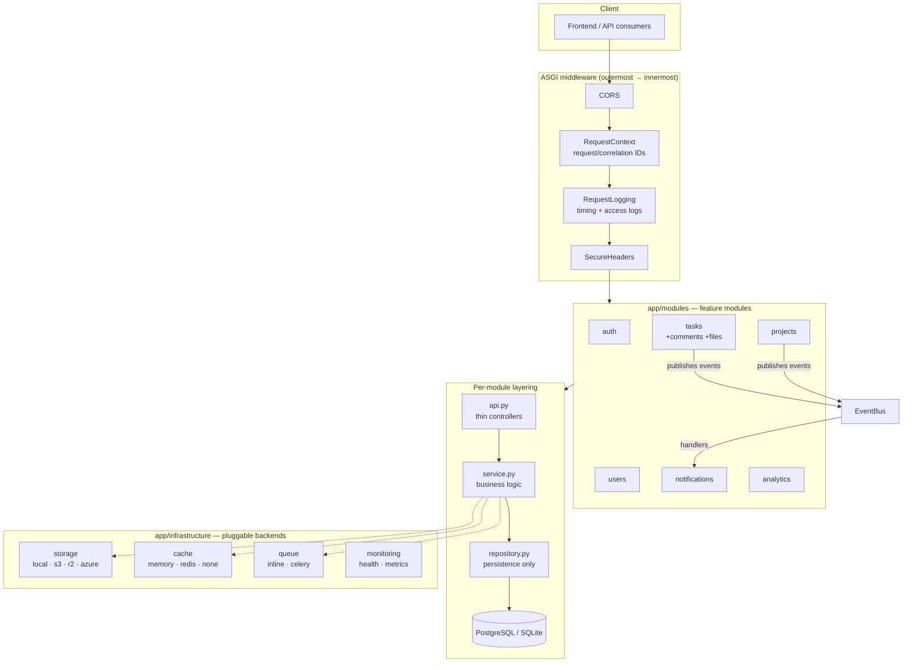

# Architecture

## Overview

The backend is a **feature-first, layered** FastAPI application. Each business
capability lives in a self-contained module; cross-cutting concerns live in
`core/`, `shared/`, and `infrastructure/`.



## Directory layout

```
app/
├── main.py            create_app() factory + lifespan (DI wiring)
├── core/              framework-level building blocks
│   ├── config.py      Settings (pydantic-settings), Environment enum
│   ├── constants.py   error codes, header names, shared limits
│   ├── database.py    Base, naming conventions, mixins, engine factory, BaseRepository
│   ├── dependencies.py  request-scoped providers (get_db, get_settings, …)
│   ├── exceptions.py  AppException hierarchy + envelope-producing handlers
│   ├── logging.py     JSON/console structured logging, contextvars
│   ├── middleware.py  request context, timing, secure headers
│   ├── permissions.py RequireRole (global RBAC primitive)
│   ├── ratelimit.py   slowapi limiter (applied to auth routes)
│   └── security.py    bcrypt (threadpool), JWT, password policy, token hashing
├── shared/            domain-agnostic reusables
│   ├── enums.py       UserRole, ProjectStatus, TaskStatus, …
│   ├── events.py      EventBus + domain event dataclasses
│   ├── pagination.py  PageParams, paginate(), sorting whitelist
│   ├── responses.py   ApiResponse[T] envelope + ok()
│   └── utils.py       uuid7(), utcnow()
├── infrastructure/    swappable technical backends (Protocol + factory each)
│   ├── storage/       local.py, s3.py, azure.py
│   ├── cache/         memory.py, redis.py
│   ├── queue/         inline.py, celery.py
│   └── monitoring/    health.py (live/ready), metrics.py (Prometheus hook)
└── modules/           feature modules (api / service / repository / schemas / models)
    ├── auth/          login, refresh rotation + reuse detection, RBAC deps
    ├── users/         user CRUD, roles
    ├── projects/      projects + membership, ProjectAccessPolicy
    ├── tasks/         tasks, kanban, comments, file attachments
    ├── notifications/ notification feed + event handlers
    └── analytics/     dashboard report + per-project analytics
```

## Request lifecycle

1. **Middleware** assigns a request ID (and propagates `X-Correlation-ID`),
   starts a timer, and will append security headers on the way out.
2. **Routing + dependencies**: FastAPI resolves the dependency graph —
   `get_db` opens a request-scoped `AsyncSession`; auth dependencies decode the
   bearer token and load the current user; permission dependencies
   (`require_admin`, `ProjectAccessPolicy`, `get_accessible_task`) enforce
   access *before* the handler body runs.
3. **Controller** (`api.py`) validates input via Pydantic schemas and delegates
   to a service. Controllers contain no business logic.
4. **Service** implements the use case, calling repositories and publishing
   domain events. Repositories only build/execute queries — they `flush()` but
   never `commit()`.
5. **Commit**: on success, `get_db` commits the session; on exception it rolls
   back and the centralized exception handlers produce the error envelope.

## Key decisions and rationale

| Decision | Rationale |
|---|---|
| **Full async (SQLAlchemy 2 AsyncSession, asyncpg)** | Non-blocking I/O end-to-end; a single worker multiplexes thousands of concurrent connections. bcrypt (CPU-bound) is offloaded to a thread pool. |
| **UUIDv7 primary keys** | Globally unique (safe for future sharding/microservice splits), non-enumerable (no ID guessing), and time-ordered so B-tree indexes stay append-mostly, unlike random UUIDv4. |
| **Response envelope via `ApiResponse[T]` response models** | A middleware-based wrapper would lie in the OpenAPI schema and break on 204s/file streams. Explicit generic response models keep Swagger truthful. Errors are enveloped by exception handlers in one place. |
| **Repository pattern + `BaseRepository`** | Services never touch SQLAlchemy query internals; soft-delete filtering happens in one place; swapping storage details never touches business logic. |
| **In-process EventBus for notifications** | Removes projects→notifications and tasks→notifications coupling. Handlers share the publisher's session, so notification rows commit atomically with the triggering change. The bus is the natural seam for moving handlers onto a broker later. |
| **Refresh-token families with reuse detection** | Tokens are stored as SHA-256 hashes. Each login starts a family; rotation revokes the old token. Replaying a rotated token revokes the *entire family* — a stolen-then-reused token kills the attacker's session along with the victim's. |
| **Permission engine as dependency classes** | `ProjectAccessPolicy` picks `project_id` off the path by parameter name, loads the project once, and returns it to the handler. Access rules are declarative and greppable at the route definition. |
| **`native_enum=False` + `sa.Uuid`** | The same migration runs unmodified on PostgreSQL and SQLite; no `ALTER TYPE` pain when enum members are added. |
| **Soft deletes on User/Project/Task/Comment** | SaaS-grade recoverability and audit trails. `BaseRepository` filters `deleted_at IS NULL` by default; a partial unique index keeps emails re-usable after account deletion. |
| **Optimistic locking on Task (`version`)** | Two users dragging the same kanban card concurrently get a clean `409 STALE_VERSION` instead of silently clobbering each other. |
| **Config via pydantic-settings + Environment enum** | Environment variables only. Production boots refuse default JWT secrets, SQLite, and debug mode. |
| **No module-level singletons** | Engine, storage, cache, queue, and event bus are built in the lifespan and injected from `app.state` — tests and scripts compose their own graphs. |

## Envelope contract

Every JSON endpoint returns:

```json
{"success": true, "message": "…", "data": …, "meta": {"pagination": …}, "errors": []}
```

Deliberate exceptions:
- `204 No Content` responses (deletes, logout, read-all) have no body.
- `GET /files/{id}/download` streams the raw file.
- `POST /auth/login` additionally duplicates `access_token`/`token_type` at the
  top level so the Swagger UI Authorize button works.

Errors carry machine-readable codes (see `app/core/constants.py`):

```json
{"success": false, "message": "…", "data": null, "meta": null,
 "errors": [{"code": "TOKEN_REUSE_DETECTED", "detail": "…", "field": null}]}
```

## Scaling path

- **Today**: single container + Postgres. In-memory cache, inline queue.
- **Next**: set `CACHE_BACKEND=redis`, `QUEUE_BACKEND=celery`, move file storage
  to `STORAGE_BACKEND=s3` — zero business-logic changes.
- **Later**: modules are import-isolated (auth/users/projects/tasks/…); each can
  be lifted into its own service, with the EventBus swapped for a message
  broker. UUID keys mean no ID reconciliation between services.
- **Reads**: analytics queries aggregate in the database; add read replicas or
  materialized views behind `AnalyticsRepository` without touching the API.
