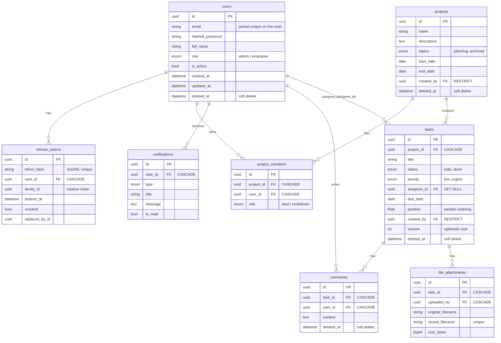

# Database Guide

## Engines

- **Production/staging**: PostgreSQL 16 via `postgresql+asyncpg://`.
- **Local development**: SQLite via `sqlite+aiosqlite:///./ats_pm.db` (default).
- **Tests**: in-memory aiosqlite.

Cross-engine compatibility is deliberate: enums are stored as `VARCHAR(32)`
with CHECK constraints (`native_enum=False`) and UUIDs use `sa.Uuid` (native
`UUID` on PG, `CHAR(32)` on SQLite), so one migration path serves both.

## Entity-relationship diagram

## Conventions

- **Primary keys**: UUIDv7 (time-ordered) generated app-side (`shared/utils.uuid7`).
- **Naming**: all constraints/indexes named via the `MetaData` naming convention
  in `core/database.py` — autogenerate diffs stay deterministic.
- **Timestamps**: `created_at`/`updated_at` on every table (`TimestampMixin`),
  timezone-aware, server defaults.
- **Soft delete**: `deleted_at` on users, projects, tasks, comments
  (`SoftDeleteMixin`). Repositories exclude soft-deleted rows by default;
  `hard_delete()` exists for genuinely disposable rows (refresh tokens).
- **Audit**: `created_by` on projects/tasks (RESTRICT — a user who authored
  records cannot be hard-deleted out from under them); soft delete preserves
  the audit trail.

## Notable indexes

| Index | Purpose |
|---|---|
| `uq_users_email_active` (partial: `deleted_at IS NULL`) | email uniqueness among live accounts; freed on soft delete |
| `ix_tasks_project_status_position` | kanban column fetch: `WHERE project_id AND status ORDER BY position` |
| `ix_notifications_user_read` | unread-badge query |
| `ix_refresh_tokens_token_hash` (unique) | O(1) token lookup on refresh |
| `ix_refresh_tokens_family_id` | family-wide revocation on reuse detection |
| single-column indexes on every FK | joins + cascade performance |

## Concurrency

- **Optimistic locking**: `tasks.version` is a SQLAlchemy `version_id_col`.
  Concurrent writes raise `StaleDataError` → HTTP `409 STALE_VERSION`.
- **Kanban ordering**: `position` floats spaced by 1000; moving between
  midpoints halves the gap. Rebalancing (rewriting positions when gaps
  exhaust) is a straightforward maintenance job if boards ever churn enough
  to need it.
